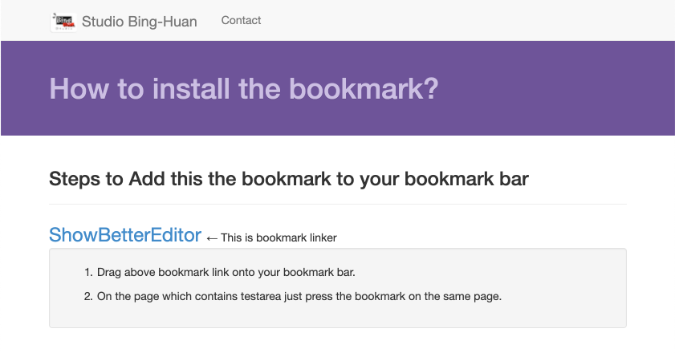

# MyBookmark



A browser bookmarklet that enhances plain textarea elements on any webpage by replacing them with a rich text editor (CKEditor). This tool allows you to use advanced text formatting features on websites that only provide basic text input fields.

## 🌐 Live Demo

**Demo Link:** [http://binghuan.github.io/mybookmark/](http://binghuan.github.io/mybookmark/)

## ✨ Features

- **One-Click Enhancement**: Transform any textarea into a rich text editor with a single bookmark click
- **CKEditor Integration**: Uses CKEditor 4.12.1 for reliable rich text editing capabilities
- **Universal Compatibility**: Works on any website with textarea elements
- **Easy Installation**: Simple drag-and-drop bookmark installation
- **No Browser Extension Required**: Pure JavaScript bookmarklet solution
- **Multiple Textarea Support**: Automatically enhances all textareas on a page

## 🚀 How It Works

The bookmarklet injects CKEditor into any webpage and automatically replaces all `<textarea>` elements with rich text editors. This enables features like:

- Bold, italic, and underlined text
- Text formatting and styling
- Lists and bullet points
- Links and media insertion
- HTML source editing
- And much more!

## 📥 Installation

### Method 1: Drag and Drop (Recommended)

1. Visit the [demo page](http://binghuan.github.io/mybookmark/)
2. Drag the **"ShowBetterEditor"** link to your browser's bookmark bar
3. That's it! The bookmarklet is now installed

### Method 2: Manual Bookmark Creation

1. Copy the JavaScript code from `inject.js` or use the minified version from the demo page
2. Create a new bookmark in your browser
3. Set the URL to: `javascript:(paste the code here)`
4. Name it "ShowBetterEditor" or any name you prefer

## 📖 Usage

1. Navigate to any webpage that contains textarea elements
2. Click the "ShowBetterEditor" bookmark in your bookmark bar
3. Wait a few seconds for CKEditor to load and replace the textareas
4. Start using the enhanced rich text editor features!

## 🛠️ Development

### Project Structure

```
mybookmark/
├── index.html          # Demo page with installation instructions
├── inject.js           # Main bookmarklet JavaScript code (readable format)
├── inject1line.js      # Minified one-line version for bookmarklet
├── oneline.sh          # Script to generate the minified version
├── css/                # Bootstrap CSS files for the demo page
├── js/                 # JavaScript libraries (jQuery, Bootstrap)
├── images/             # Logo and UI images
├── icons/              # Various icon sizes
└── fonts/              # Bootstrap font files
```

### Key Files

- **`inject.js`**: The main JavaScript code that enhances textareas
- **`inject1line.js`**: Minified version created by `oneline.sh` script
- **`index.html`**: Demo page with instructions and the bookmarklet link
- **`oneline.sh`**: Shell script to minify the JavaScript code into one line

### Building

To regenerate the minified bookmarklet code:

```bash
chmod +x oneline.sh
./oneline.sh
```

This script reads `inject.js` and creates a minified `inject1line.js` file.

## 🔧 Technical Details

### Dependencies

- **CKEditor 4.12.1**: Loaded dynamically from CDN
- **Bootstrap 3.x**: Used for the demo page styling
- **jQuery 1.11.1**: Required for Bootstrap functionality

### Browser Compatibility

The bookmarklet works on all modern browsers that support:
- JavaScript ES5
- DOM manipulation
- Dynamic script loading

### How the Injection Works

1. The bookmarklet injects CKEditor from CDN into the current page
2. Scans for all `<textarea>` elements on the page
3. Replaces each textarea with a CKEditor instance after a 3-second delay
4. Automatically sets HTML format option if available

## 🏷️ Tags

`bookmarklet` `javascript` `ckeditor` `textarea` `rich-text-editor` `browser-tool` `web-enhancement`


